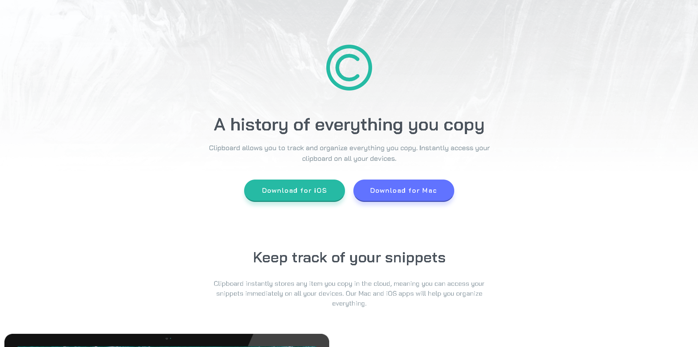

# 📋 Clipboard Landing Page

  

  
  
  

---

## ✨ Sobre o projeto

Este projeto foi desenvolvido a partir de um desafio da plataforma Frontend Mentor, com o objetivo de recriar uma landing page moderna e responsiva com base em um design fornecido.

A proposta foi transformar um layout estático em uma aplicação real, focando em **boas práticas de desenvolvimento front-end**, fidelidade visual e responsividade.

---

## 🚀 Objetivo do desafio

* Construir uma landing page fiel ao design original
* Desenvolver um layout **totalmente responsivo**
* Aplicar **hover states** nos elementos interativos
* Utilizar boas práticas de HTML e CSS

🔗 Acesse o desafio:
[https://www.frontendmentor.io/challenges/clipboard-landing-page-LG9z0nEj](https://www.frontendmentor.io/challenges/clipboard-landing-page-LG9z0nEj)

---

## 🛠️ Tecnologias utilizadas

  

* HTML5
* CSS3
* Bootstrap
* Google Fonts (Bai Jamjuree)
* Bootstrap Icons

---

## 💡 Aprendizados

Durante o desenvolvimento deste projeto, foram trabalhadas habilidades importantes como:

* Estruturação semântica com HTML
* Organização e reutilização de estilos com CSS
* Uso de variáveis (`:root`) para padronização
* Responsividade com **media queries**
* Layout com **Flexbox** e **CSS Grid**
* Interpretação de layout apenas com imagem (sem Figma PRO)

---

## 🌟 Destaques do projeto

✔️ Design limpo e moderno
✔️ Layout responsivo (mobile-first)
✔️ Código organizado e escalável
✔️ Uso consistente de variáveis CSS
✔️ Componentização de estilos
✔️ Boa experiência visual e interativa

---

## 📸 Preview

  

---

## 🔗 Conecte-se comigo

  
  
  

---

## 📚 Sobre a plataforma

O Frontend Mentor é uma plataforma que oferece desafios práticos para desenvolvedores aprimorarem suas habilidades construindo projetos reais com base em designs profissionais.

---

## ⚠️ Aviso

Este projeto foi desenvolvido com fins **educacionais**, como parte da minha jornada de aprendizado em desenvolvimento front-end.

---

## 📌 Status do projeto

  

---

## 🚀 Próximos passos (opcional)

* Melhorar acessibilidade (a11y)
* Adicionar animações sutis
* Otimizar performance
* Refatorar para metodologia BEM ou CSS Modules
